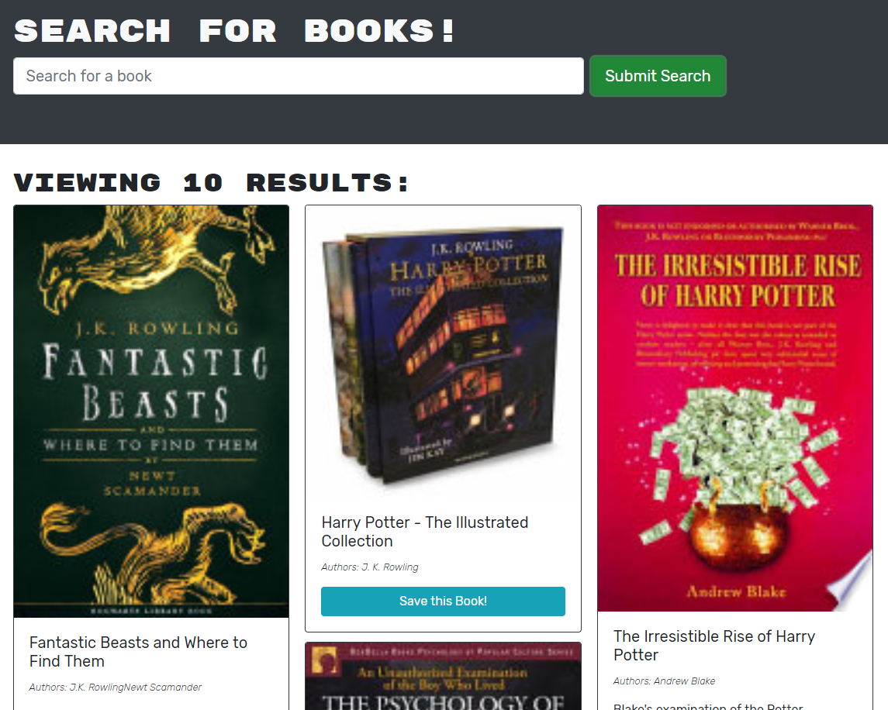

# E-bookmark

E-bookmark is a project i was given to help understand how graphql works and how to refractor code to use graphql that was previously using a restAPI!
there are some things about graphql that i know can be done that i was not able to replicate, the first being updating data on the fly so users where imedately aware visualy that a book had been removed form their list.

there was a lot of struggles i had with doing this project mentally and it showed in the early stages of my work.
im glad i got to learn and use graphql more but it feels like theres so much more to do with the apolloserver infistructure that i did not utilize.

[Visit the live site](https://e-bookmark.herokuapp.com/)

## about me:

Hi i am Alex ["Drkeck"](https://github.com/drkeck) Keckley, i am a student and a avid learner of Full stack development!
feel free to contact at `K3ckley.a@gmail.com` or visit my github to see what other projects i have under my belt, i hope i don't dissapoint!